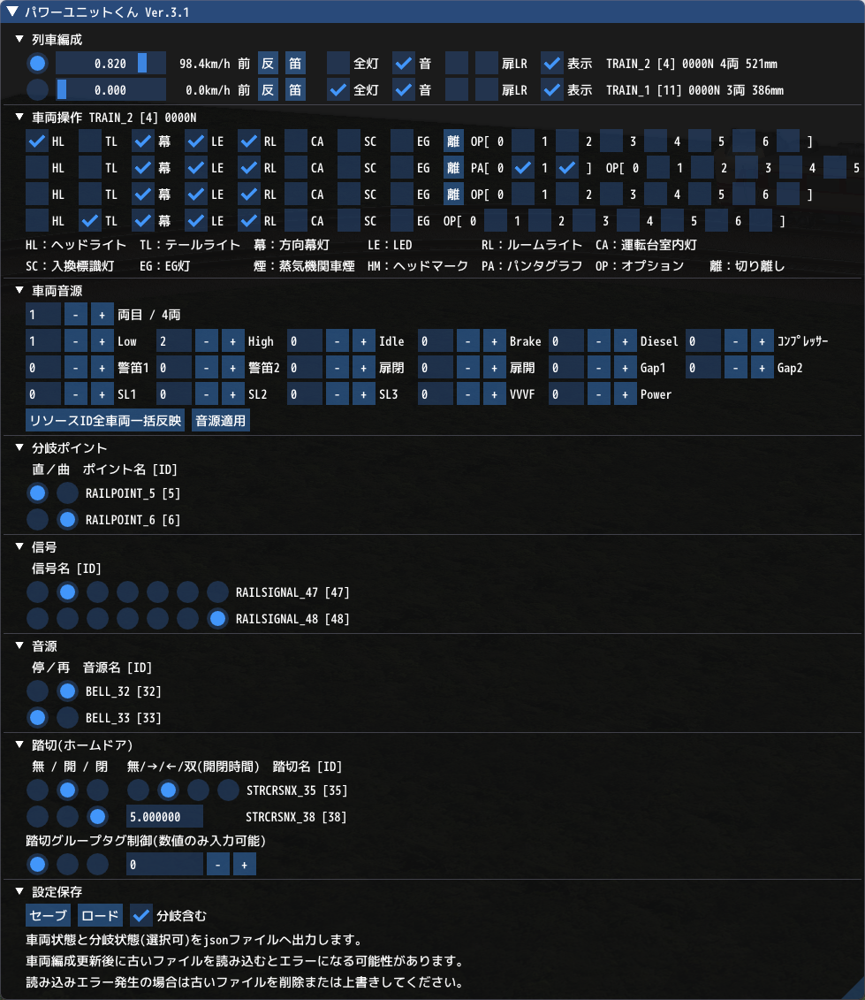

# VRMNXパワーユニットくん


## 概要
「パワーユニットくん」は「[鉄道模型シミュレーターNX](http://www.imagic.co.jp/hobby/products/vrmnx/ "鉄道模型シミュレーターNX")」（VRMNX）で複数の編成とポイントを操作するためのImGuiウィンドウです。  

## ダウンロード
- [powerunit.py](https://raw.githubusercontent.com/CaldiaNX/vrmnx-ugokunndesu/main/powerunit.py)

## 利用方法
レイアウトファイルと同じフォルダ階層に「powerunit.py」ファイルを配置します。  

フォルダ構成：
```
C:\VRMNX（一例）
├ powerunit.py
├ VRMNXレイアウトファイル.vrmnx
└ VRMNXレイアウトファイル_pw.json（保存機能で自動作成）
```

対象レイアウトのレイアウトスクリプトに以下の★内容を追記します。  

```py
import vrmapi
import powerunit # ★インポート

def vrmevent(obj,ev,param):
    powerunit.vrmevent(obj,ev,param) # ★メイン処理
    if ev == 'init':
        dummy = 1
# (省略) #
```

ファイル読み込みに成功するとビュワー起動直後にスクリプトログへ下記メッセージが表示されます。

```
import パワーユニットくん Ver.x.x
```

## 操作説明
### ウィンドウの表示/非表示切り替え
「p」キーを押すとウィンドウの表示/非表示を切り替えできます。  
初期表示状態を変える場合は「_drawEnable」のTrue/Falseを変更して下さい。

### 列車編成
「ダミー編成」以外の編成が一覧に表示されます。

- 「アクティブ編成」ラジオボタン
  - 押すと列車編成が[アクティブ](https://vrmcloud.net/nx/script/script/train/SetActive.html)になります。
  - 車両操作の対象となります。
- 「電圧」スライドバー
  - 動かすと編成の[速度(電圧)を変更](https://vrmcloud.net/nx/script/script/train/SetVoltage.html)します。
- 「反」ボタン
  - 押すと編成の[進行方向を反転](https://vrmcloud.net/nx/script/script/train/Turn.html)します。
- 「笛」ボタン
  - 列車の[警笛](https://vrmcloud.net/nx/script/script/train/PlayHorn.html)を鳴らします。
- 「全灯」チェックボックス
  - 電装系のON/OFFを一括で切り替えます。
- 「音」チェックボックス
  - [サウンド再生モード](https://vrmcloud.net/nx/script/script/train/SetSoundPlayMode.html)のON/OFFを切り替えます。
- 「扉LR」チェックボックス
  - [扉の開閉](https://vrmcloud.net/nx/script/script/car/OpenDoor_Side.html)に対応した車両の客室扉を開閉します。
- 「表示」チェックボックス
  - [編成の表示](https://vrmcloud.net/nx/script/script/train/SetVisible.html)を変更します。
- 末尾に編成名、オブジェクトID、列車番号、車両数、編成長が表示されます。

### 車両操作
「アクティブ編成」ラジオボタンで選択した編成の車両を個別操作できます。

|列|略称|操作対象|関連関数|
|--|----|--------|--------|
| 1|－|号車        |[GetCarNumber](https://vrmcloud.net/nx/script/script/car/GetCarNumber.html)|
| 2|HL|ヘッドライト|[GetHeadlight](https://vrmcloud.net/nx/script/script/car/GetHeadlight.html) / [SetHeadlight](https://vrmcloud.net/nx/script/script/car/SetHeadlight.html)|
| 3|TL|テールライト|[GetTaillight](https://vrmcloud.net/nx/script/script/car/GetTaillight.html) / [SetTaillight](https://vrmcloud.net/nx/script/script/car/SetTaillight.html)|
| 4|幕|方向幕      |[GetRollsignLight](https://vrmcloud.net/nx/script/script/car/GetRollsignLight.html) / [SetRollsignLight](https://vrmcloud.net/nx/script/script/car/SetRollsignLight.html)|
| 5|LE|LED         |[GetLEDLight](https://vrmcloud.net/nx/script/script/car/GetLEDLight.html) / [SetLEDLight](https://vrmcloud.net/nx/script/script/car/SetLEDLight.html)|
| 6|RL|ルームライト|[GetRoomlight](https://vrmcloud.net/nx/script/script/car/GetRoomlight.html) / [SetRoomlight](https://vrmcloud.net/nx/script/script/car/SetRoomlight.html)|
| 7|CA|運転台室内灯|[GetCabLight](https://vrmcloud.net/nx/script/script/car/GetCabLight.html) / [SetCabLight](https://vrmcloud.net/nx/script/script/car/SetCabLight.html)|
| 8|SC|入換標識灯  |[GetSCIndicator](https://vrmcloud.net/nx/script/script/car/GetSCIndicator.html) / [SetSCIndicator](https://vrmcloud.net/nx/script/script/car/SetSCIndicator.html)|
| 9|EG|EG灯        |[GetEGIndicator](https://vrmcloud.net/nx/script/script/car/GetEGIndicator.html) / [SetEGIndicator](https://vrmcloud.net/nx/script/script/car/SetEGIndicator.html)|
|10|離|切離し      |[SplitTrain](https://vrmcloud.net/nx/script/script/train/SplitTrain.html)|
|11|煙|蒸気機関車煙|[GetSmoke](https://vrmcloud.net/nx/script/script/car/GetSmoke.html) / [SetSmoke](https://vrmcloud.net/nx/script/script/car/SetSmoke.html)|
|12|HM|ヘッドマーク|[GetHeadmarkDisp](https://vrmcloud.net/nx/script/script/car/GetHeadmarkDisp.html) / [SetHeadmarkDisp](https://vrmcloud.net/nx/script/script/car/SetHeadmarkDisp.html) / [GetCountOfHeadmark](https://vrmcloud.net/nx/script/script/car/GetCountOfHeadmark.html)|
|13|PA|パンタグラフ|[GetPantograph](https://vrmcloud.net/nx/script/script/car/GetPantograph.html) / [SetPantograph](https://vrmcloud.net/nx/script/script/car/SetPantograph.html) / [GetCountOfPantograph](https://vrmcloud.net/nx/script/script/car/GetCountOfPantograph.html)|
|14|OP|オプション  |[GetOptionDisp](https://vrmcloud.net/nx/script/script/car/GetOptionDisp.html) / [SetOptionDisp](https://vrmcloud.net/nx/script/script/car/SetOptionDisp.html)|

- 「切り離し」は2両以上の編成かつ最後尾車両以外で表示されます。
- 「蒸気機関車煙」は[車輌の種類](https://vrmcloud.net/nx/script/script/car/GetCarType.html)が蒸気機関車（テンダー含む）で表示されます。
- 「ヘッドマーク」と「パンタグラフ」は設定のある車両のみ表示されます。

### センサー情報表示
センサーに以下のサンプルコードを記載することで、編成リスト末尾にセンサー名を表示することが出来ます。

```py
elif ev == 'catch':
    # 通過列車オブジェクトを定義
    tr = obj.GetTrain()
    # 列車のDict配列を取得
    di = tr.GetDict()
    # キーに文字列を定義
    di["pw_msg"] = obj.GetNAME() + " 通過"
```

### 車両音源
車両を選択して編成リソースIDを指定して「音源適用」ボタンを押すと編成内の全車両に一括で音源を適用します。  
「リソースID全車両一括反映」ボタンを押すと、表示している編成リソースIDを編成内の全車両に一括で反映します。

無効なIDは予期せぬ不具合が生じる可能性があります。  
以下の命令に対応しています。

|列|略称|対象|関連関数|
|--|----|----|--------|
| 1|Low    |標準走行音|[SetWaveLow](https://vrmcloud.net/nx/script/script/car/SetWaveLow.html)|
| 2|High   |高速走行音|[SetWaveHigh](https://vrmcloud.net/nx/script/script/car/SetWaveHigh.html)|
| 3|Idle   |アイドリング音|[SetWaveIdle](https://vrmcloud.net/nx/script/script/car/SetWaveIdle.html)|
| 4|Brake  |ブレーキ音|[SetWaveBrake](https://vrmcloud.net/nx/script/script/car/SetWaveBrake.html)|
| 5|Diesel |ディーゼル音|[SetWaveDiesel](https://vrmcloud.net/nx/script/script/car/SetWaveDiesel.html)|
| 6|コンプレッサー|コンプレッサー音|[SetWaveCompressor](https://vrmcloud.net/nx/script/script/car/SetWaveCompressor.html)|
| 7|警笛1/2|警笛音(メイン/サブ)|[SetWaveHorn](https://vrmcloud.net/nx/script/script/car/SetWaveHorn.html)|
| 8|扉閉/開|ドア音|[SetWaveDoorClose](https://vrmcloud.net/nx/script/script/car/SetWaveDoorClose.html) / [SetWaveDoorOpen](https://vrmcloud.net/nx/script/script/car/SetWaveDoorOpen.html)|
|10|Gap1/2 |レール継ぎ目通過音|[SetWaveGap1](https://vrmcloud.net/nx/script/script/car/SetWaveGap1.html) / [SetWaveGap2](https://vrmcloud.net/nx/script/script/car/SetWaveGap2.html)|
|11|SL1/2/3|蒸気機関車音|[SetWaveSL1](https://vrmcloud.net/nx/script/script/car/SetWaveSL1.html) / [SetWaveSL2](https://vrmcloud.net/nx/script/script/car/SetWaveSL2.html) / [SetWaveSL3](https://vrmcloud.net/nx/script/script/car/SetWaveSL3.html)|
|12|VVVF   |VVVF音|[SetWaveVVVF](https://vrmcloud.net/nx/script/script/car/SetWaveVVVF.html)|
|13|Power  |発電機音|[SetWavePower](https://vrmcloud.net/nx/script/script/car/SetWavePower.html)|

### 分岐ポイント
頭文字に「dummy」が付くオブジェクト以外が操作対象になります。

- 「直/曲」ラジオボタン
  - ポイントの[分岐方向](https://vrmcloud.net/nx/script/script/point/SetBranch.html)を「直進」と「分岐」に切り替えます。

### 信号
頭文字に「dummy」が付くオブジェクト以外が操作対象になります。  
ステータス番号0以外は設定値が異なるため非対応です。

- 点灯ラジオボタン
  - ステータス番号0の点灯状態を0～6で設定します。基本的には以下の状態を表示します。

|   0|   1|   2|   3|   4|   5|   6|
|----|----|----|----|----|----|----|
|消灯|停止|警戒|注意|減速|抑速|進行|

### 音源
頭文字に「dummy」が付くオブジェクト以外が操作対象になります。  
再生と停止ができます。  

### 踏切(ホームドア)
頭文字に「dummy」が付くオブジェクト以外が操作対象になります。  
開閉状態を操作できます。  
警報機(開閉設定時間が0.0s固定のオブジェクト)は進行方向指示器を操作できます。  
遮断機またはホームドアは開閉時間を設定できます。  

踏切タググループを入力して一括制御できます。  
(ImGuiのInputBox未実装のため、入力文字は整数値に制限されます)

### エミッター
頭文字に「EMITTER_」が付かない名前変更されたオブジェクトが操作対象になります。  
以下の命令に対応しています。

|列|略称|対象|関連関数|
|--|----|----|--------|
| 1|Start|エミッター開始      |[Start](https://vrmcloud.net/nx/script/script/emitter/Start.html)|
| 2|Stop |エミッター停止      |[Stop](https://vrmcloud.net/nx/script/script/emitter/Stop.html)|
| 3|Kick |エミッターを1回実行 |[Kick](https://vrmcloud.net/nx/script/script/emitter/Kick.html)|
| 4|スライドバー|パーティクル生成数調整|[SetPCreateFactor](https://vrmcloud.net/nx/script/script/emitter/SetPCreateFactor.html)|


### 設定保存
「セーブ」ボタンを押すと車両設定とポイント設定の状態をjsonファイルへ保存できます。  
「ロード」ボタンを押すとjsonファイルから状態を復元します。  

下記のコメントを外すとレイアウトビュワー起動時に自動ロードします。  
ロードでエラーが発生する場合はコメントアウトしてください。

```py
# 自動ロードを有効にする場合はコメントアウトを外す
loadConfig() # ★ここのコメントアウトを外す
```


## 履歴
- 2025/03/16 v3.2
  - エミッターに対応
- 2024/06/09 v3.1
  - 編成表示切替を追加
  - 車両オプションを4個から7個(0～6)へ追加(キハ40系以降対応)
  - 編成長の表示を追加。編成長は先頭車両の前輪軸から最後尾の後輪軸までの合算距離。
  - 編成情報文字列の生成を毎フレームから連結・切り離し時に変更。連結・切り離しは毎フレームに有効編成数増減から検出。
  - ウィンドウの「車両編成」文字を「列車編成」に変更。
- 2023/01/12 v3.0
  - 踏切(ホームドア)を制御に追加
  - 車両編成の向き「前/後」表示を追加
  - 「分岐含む」にチェックが無い場合はファイルロードで分岐情報を読み込みしないように変更。
  - テキスト表記を修正
  - ソース内コメント誤字を修正
  - 車両編成以外のオブジェクトリスト管理方法を変更。  初回起動時にdummyを除外したリストをレイアウトオブジェクトへ格納して再利用します。  毎フレームのnew生成とList取得が無くなり負荷軽減となります。
    > 編成オブジェクト以外は、ビュワー起動後、オブジェクト数は増減しません。  
    > ビュワー起動時にGet系またはList系関数で取得すると速度が向上します。
- 2022/09/13 v2.2
  - 音源リソース4つのファイルセーブ時Copy漏れを修正
  - ファイルロード時のSetSound重複処理を修正
  - 編成リストを折り畳んだ状態でファイルロードした場合に車両リスト読み取りエラーになる不具合を修正
- 2022/09/10 v2.1
  - eventUIDを定義
  - セーブファイル名の末尾に「_pw」付与
  - 自動ロード用のコードを追記(デフォルト無効)
- 2022/09/04 v2.0
  - 車両音源リソース設定機能 追加
  - 音源オブジェクト操作機能 追加
  - 状態保存機能 追記
  - 編成名表示位置を変更(操作位置の固定化)
  - 反転・警笛ボタン位置の変更
  - チェックボックスと表記文字の位置を入れ替え(ImGui本来の仕様)
  - 「幕」「煙」の略字を変更
- 2021/05/25 v1.5
  - Active編成の選択をラジオボタンに変更
  - データ名と編成番号の表示位置を入れ替え(標準ラベル表記に合わせる)
  - 「扉」チェックボックスを縮小
  - 「音」チェックボックスの初期状態を「GetSoundPlayMode」で取得するように改善
  - 他、ヘッダーやコメントアウトしていたコードなどを整理
- 2021/03/10 v1.4
  - ウィンドウON/OFFを簡略化
  - 操作説明を2行
  - 1両の時にテールライトが点灯しない条件を修正
- 2021/02/25 v1.3
  - 切り離しボタンを1両の時に非表示
  - 編成に列車番号と車両数を追加
- 2021/02/24 v1.2
  - ファイル読み込み成功時のメッセージ変更
  - 連結/切離し対応
  - 信号対応(一部)
- 2021/02/14 v1.0
  - ファイル名を変更
  - 呼び出し方法を変更
  - 車両個別操作に対応
  - ポイントにID追加
  - 扉の開閉に対応
  - その他、多数の処理最適化
- 2021/02/13 v0.2 (β版)
  - 名前変更
  - 電圧の隣にkm/h速度併記
  - スライドバーに速度をリアルタイム反映
  - 編成ボタンにSetActiveを追加
  - 電灯と音スイッチを3種に分離
  - ポイントの表示順を変更(ポイント名称での表示ずれを抑えるため)
- 2021/02/12 v0.1 (α版)
  - 新規作成
